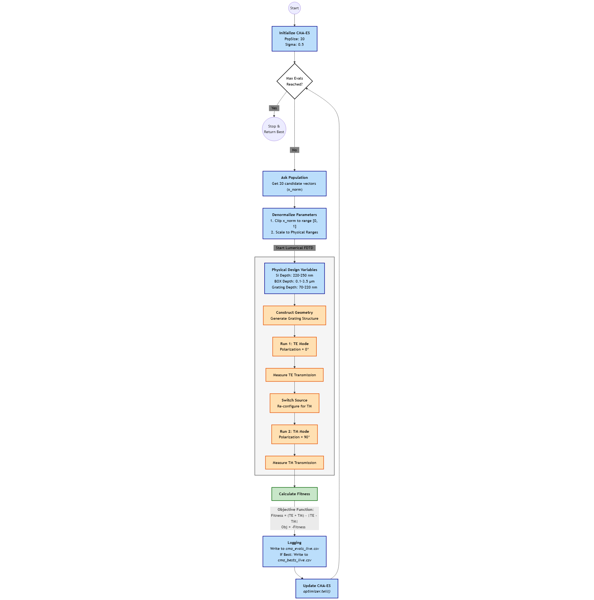
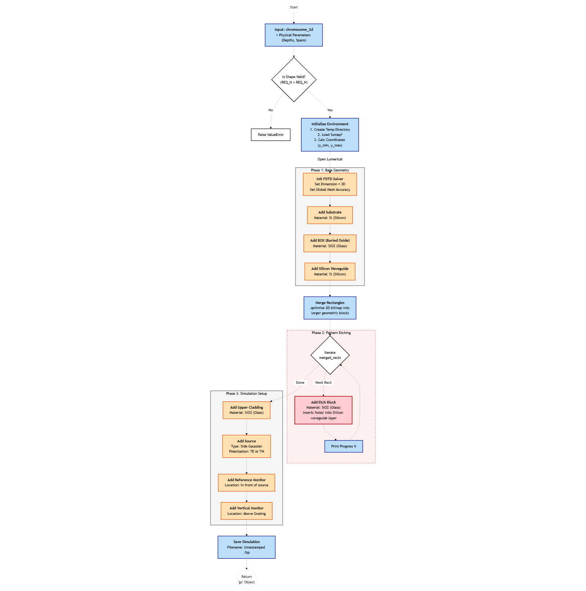

# Evolutionary Optimization of Polarization-Independent Grating Couplers

This repository shows the optimization of silicon photonic grating couplers using CMA-ES algorithm.

This work is part of an M.Tech research project. The source code is not publicly shared but can be made available upon reasonable request. The system architecture is shown below with block diagrams.

## Project Overview

The project uses the CMA-ES algorithm to maximize the normalized transmission simultaneously for both TE and TM modes by controlling the variables: Silicon Waveguide, BOX, and grating depths.

## Optimization Strategy

The optimization follows a two-stage approach:

#### Stage 1: Profile Screening

Multiple symmetric grating profiles are generated and evaluated. 

Poor-performing geometries are rejected based on transmission performance.

Only promising profiles are forwarded to the optimization stage.

#### Stage 2: CMA-ES Optimization

The selected grating profiles were further optimized using CMA-ES algorithm with the three controlling variables: silicon waveguide, BOX, and grating depths.

## System Design 

#### The CMA-ES driver block

#### The Grating Coupler Construction and Simulation block

## The Result

Best result: TE transmission = 0.7247, TM transmission = 0.7359